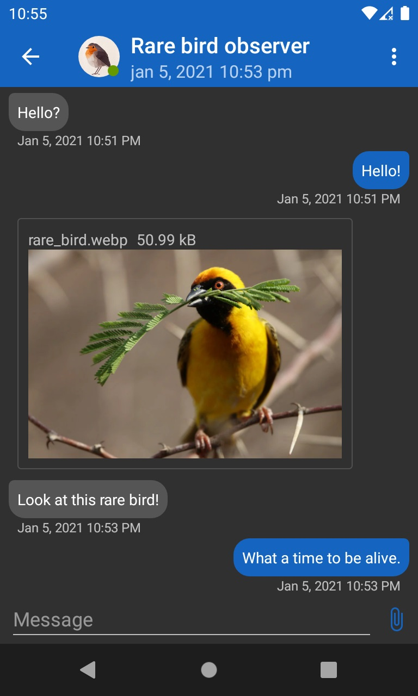

# aTox

[][weblate]

The reasonable Tox client for Android.

 

## Building

Clone!

`git clone https://github.com/evilcorpltd/aTox.git`

Build!

`gradlew build`

## Translation

Want to see aTox in your language? Contribute a translation on [Weblate!][weblate]

[][weblate]

[weblate]: https://hosted.weblate.org/engage/atox/
